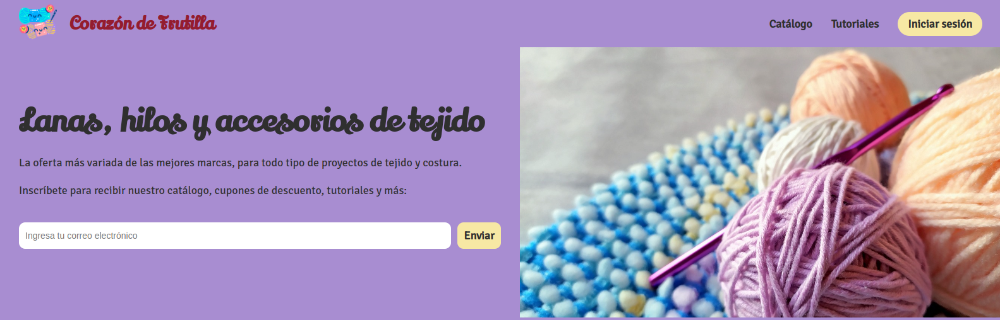
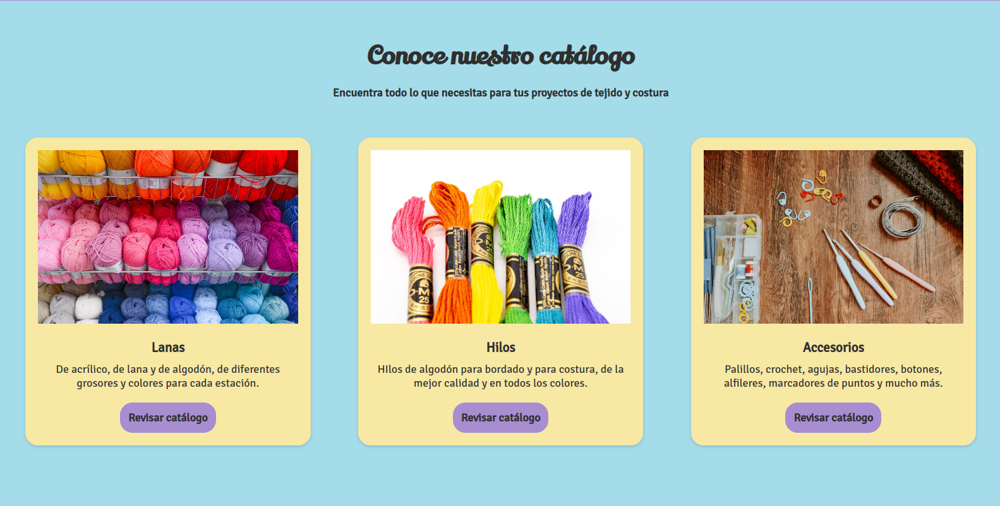
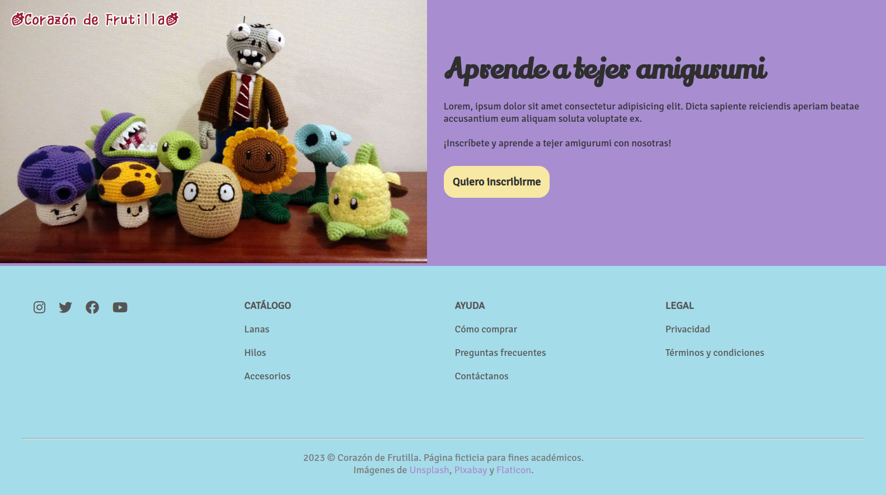

# "Corazón de Frutilla" Landing Page

## Description

This is a landing page for a ficticious business called "Corazón de Frutilla", an online store that sells knitting and crocheting supplies. I made this web site as my first project for a full-stack development bootcamp by UDD, Chile. The goal of this project was to practice building responsive websites using HTML and CSS.

## Screenshots

## Built with

This web page was built with the following tools:

* HTML: Markup language
* CSS: Style sheet language

## Credits

This site was developed by [Andrea Olivos B](https://github.com/aolivos15).

The images used in this project are from the following sources:

* [Website logo](https://www.flaticon.com/free-stickers/crochet) - by [Flaticon](https://www.flaticon.com/)
* [Jumbotron image](https://pixabay.com/es/photos/tejido-tejer-ganchillo-de-tejer-5276453/) - by [kumoknits](https://pixabay.com/es/users/kumoknits-16197340) on [Pixabay](https://pixabay.com)
* [Yarn](https://pixabay.com/es/photos/lana-tienda-pasatiempo-artesan%c3%ada-2742119/) - by [Skitterphoto](https://pixabay.com/es/users/skitterphoto-324082/) on [Pixabay](https://pixabay.com)
* [Embroidery thread](https://unsplash.com/photos/4J1sjmMr0Ro) - by [Mel Poole](https://unsplash.com/@melpoole) on [Unsplash](https://unsplash.com)
* [Crocheting accessories](https://unsplash.com/photos/9rStyyFGKQA) - by [Edz Norton](https://unsplash.com/@edznorton) on [Unsplash](https://unsplash.com)
* [Amigurumi](https://aolivos15.github.io/P1-landing-page/) - by [Andrea Olivos B](https://github.com/aolivos15)

